<picture>
  <source media="(prefers-color-scheme: dark)" srcset="assets/banner-dark.svg">
  
</picture>

# PJ Dailey
**Systems Software & AI Infrastructure Engineer**

`§ ABOUT`

---

Computer Science & Mathematics student at St. Edward's University (4.0/4.0 GPA) and NCAA Division II student-athlete. Specializing in low-level systems, hardware acceleration, and deterministic execution pipelines.

`§ PROJECTS`

---

### SIMD-Accelerated Distributed Vector Database

> **Throughput:** Engineered a vector search core in C, bypassing standard math libraries with custom AVX2 / AVX-512 intrinsics to hit 120 GFLOPS computational throughput and sub-500ms distance calculations.

> **Storage & Indexing:** Implemented POSIX memory-mapped files (mmap) for zero-copy disk persistence with reader-writer locks. Replaced linear scans with a Hierarchical Navigable Small World (HNSW) graph index to guarantee O(log N) search latency at 15,000 QPS.

### Hybrid Limit Order Book Engine

> **Execution:** Designed an institutional financial exchange engine achieving strict O(1) order execution with 3 microsecond latency, measured via rdtsc hardware timestamp counters and Google Benchmark.

> **Memory & Concurrency:** Paired custom hash maps with contiguous memory-pooled doubly linked lists to preserve CPU cache locality. Routed live trades through a Single-Producer/Single-Consumer (SPSC) lock-free queue to stream execution updates to 1,000+ concurrent clients with <5ms network jitter.

### Hardware-Accelerated CUDA Inference Engine

> **Edge Performance:** Built a bare-metal computer vision pipeline in C++ to replace high-overhead Python runtimes.

> **GPU Graph Management:** Authored custom CUDA kernels for parallel image pre-processing and Non-Maximum Suppression (NMS), maintaining the entire execution graph on an RTX 3060 Ti to sustain a strict 2.5ms frame latency.

### Sandboxed AI Execution Runtime

> **Isolation & Speed:** Orchestrated an isolated execution framework evaluating LLM code payloads in pre-warmed container pools (<150ms spin-up latency).

> **Security Pipeline:** Built a low-latency AST parser (<500 microsecond evaluation) to sanitize untrusted scripts, streaming stdout/stderr over low-overhead IPC pipelines.

`§ STACK`

---

| Category | Stack |
|---|---|
| Languages | C23, C++23, Java, CUDA, x86 NASM Assembly, Python, TypeScript, SQL |
| Systems / HPC | SIMD (AVX-512 / AVX2), POSIX mmap, Memory Pools, SPSC Lock-Free Queues, gRPC |
| GPU & AI | TensorRT, CUDA Kernels, PyTorch, Computer Vision Pipelines |
| Profiling / Dev | Perf, Valgrind, Gprof, CMake, Linux, Docker, WebSockets |

---

`// EOF`

